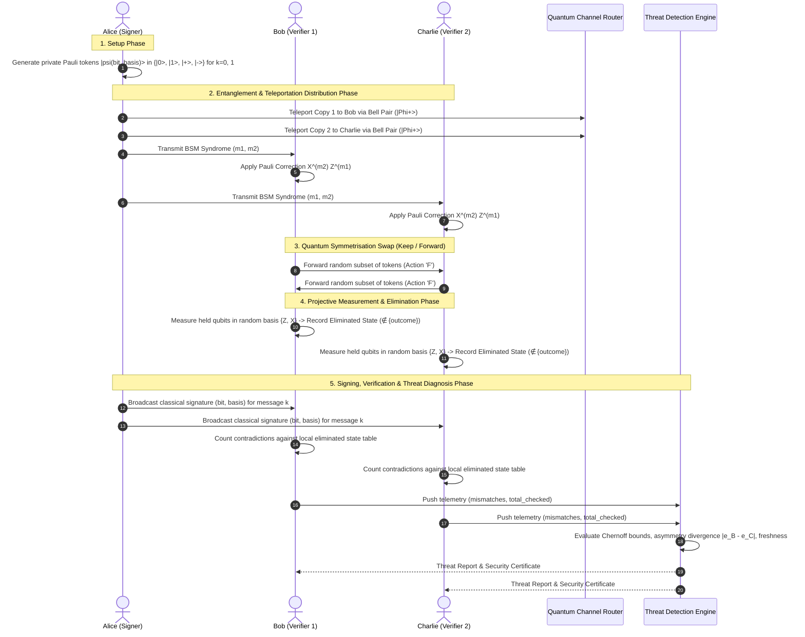
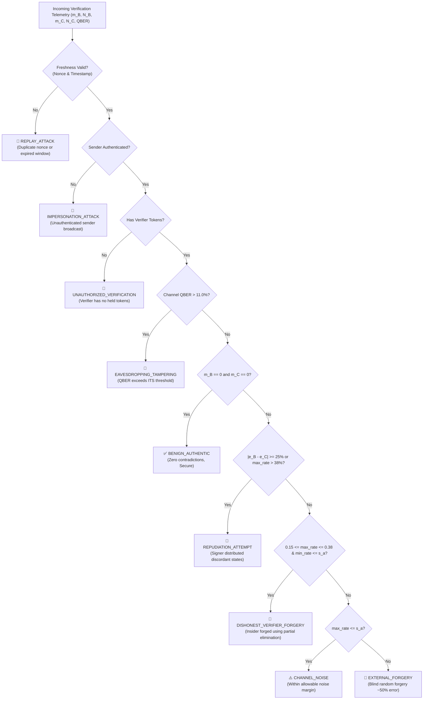

# Quantum-Inspired Cyber Threat Detection for Digital Signature Security (QDS Framework)

## 1. Executive Summary & Problem Context

Classical public-key cryptographic systems such as **RSA** and **ECDSA** (Elliptic Curve Digital Signature Algorithm) underpin modern internet security, authentication, and digital non-repudiation. However, their security relies on the computational hardness of mathematical problems (integer factorization and discrete logarithms) that can be solved in polynomial time by quantum computers running **Shor's Algorithm**.

**Quantum Digital Signatures (QDS)** provide **Information-Theoretic Security (ITS)** rooted in the fundamental laws of quantum physics (Heisenberg's Uncertainty Principle, the Quantum No-Cloning Theorem, and Quantum Entanglement) rather than unproven computational hardness assumptions.

This project delivers a **comprehensive software simulation and cyber threat detection framework** tailored to **teleportation-based Quantum Digital Signature protocols**. It combines quantum state preparation, Bell-state entanglement distribution, quantum teleportation with feed-forward Pauli corrections ($X^{m_2} Z^{m_1}$), orthogonal state elimination via projective measurements, and a **non-AI/ML deterministic threat detection engine** powered by Chernoff-Hoeffding statistical hypothesis testing.

---

## 2. High-Level Architecture

The architecture is structured into decoupled, modular layers:

```mermaid
graph TD
    subgraph UI_Layer ["Presentation & Telemetry Layer"]
        V1["Interactive Visualizer (HTML5 / Vanilla CSS / ES6 / Canvas)"]
        V2["Live Diagnostic Dashboard & Telemetry Stream"]
    end

    subgraph Detection_Layer ["Threat Detection & Cryptanalysis (No AI/ML)"]
        DE["QDSDetectionEngine (engine.py)"]
        SB["QDSSecurityBounds (Chernoff-Hoeffding Certificates)"]
        FT["FreshnessTracker (Nonce & Timestamp Registry)"]
    end

    subgraph Protocol_Layer ["Quantum Protocol Orchestration"]
        TP["TeleportationQDSProtocol (teleportation_qds.py)"]
        QP["Direct QDSProtocol (qds.py)"]
        SPP["SecurePointToPointProtocol (BB84 QKD Engine)"]
    end

    subgraph Network_Layer ["Multi-Port Distributed Daemon Network"]
        R8000["ChannelProxyNode (Port 8000) - Router & Eve Proxy"]
        A8001["AliceDaemon (Port 8001) - Signer"]
        B8002["VerifierDaemon Bob (Port 8002)"]
        C8003["VerifierDaemon Charlie (Port 8003)"]
        D8004["DetectorDaemon (Port 8004) - Threat Monitor"]
    end

    subgraph Quantum_Core ["Quantum Simulation Engine (Qiskit / Aer)"]
        QC["Circuit Builder (circuit.py)"]
        EPR["Bell Pair Generator (|Phi+>)"]
        BSM["Bell State Measurement & Feed-Forward Pauli Gates"]
        CH["Quantum Channels (Depolarizing, BitFlip, InterceptResend)"]
    end

    UI_Layer --> Detection_Layer
    Detection_Layer --> Protocol_Layer
    Protocol_Layer --> Network_Layer
    Network_Layer --> Quantum_Core
```



---

## 3. Protocol Workflow & Quantum Operations

The teleportation-based QDS protocol executes across a 3-party topology (Alice, Bob, Charlie) in five primary phases:



### 3.1 Step-by-Step Breakdown

1. **Private Token Generation**:
   Alice selects random bit strings $b \in \{0, 1\}^L$ and basis strings $\theta \in \{0, 1\}^L$.
   - $(b=0, \theta=0) \rightarrow |0\rangle$
   - $(b=1, \theta=0) \rightarrow |1\rangle$
   - $(b=0, \theta=1) \rightarrow |+\rangle = \frac{|0\rangle + |1\rangle}{\sqrt{2}}$
   - $(b=1, \theta=1) \rightarrow |-\rangle = \frac{|0\rangle - |1\rangle}{\sqrt{2}}$

2. **Quantum Teleportation Distribution**:
   For each token, an entangled Bell pair $|\Phi^+\rangle = \frac{|00\rangle + |11\rangle}{\sqrt{2}}$ is generated between Alice and the verifier. Alice performs a **Bell State Measurement (BSM)** on the token and her half of the Bell pair, yielding classical syndromes $m_1, m_2 \in \{0, 1\}$. The receiver applies local feed-forward Pauli gates:
   $$\sigma = X^{m_2} Z^{m_1}$$
   This reconstructs the exact private state $|s\rangle$ at the receiver's node.

3. **Symmetrisation (Non-Repudiation)**:
   Bob and Charlie randomly choose to **Keep (K)** or **Forward (F)** each received token to the other party. Alice does not know which party holds which token, preventing Alice from creating an asymmetric signature that only one verifier accepts.

4. **Orthogonal State Elimination**:
   Each verifier measures their held token in a randomly chosen basis $\theta_m \in \{0, 1\}$:
   - Measurement in $Z$-basis ($\theta_m=0$) yielding outcome $0 \implies |1\rangle$ is **eliminated** (ruled out).
   - Measurement in $Z$-basis ($\theta_m=0$) yielding outcome $1 \implies |0\rangle$ is **eliminated**.
   - Measurement in $X$-basis ($\theta_m=1$) yielding outcome $0 \implies |-\rangle$ is **eliminated**.
   - Measurement in $X$-basis ($\theta_m=1$) yielding outcome $1 \implies |+\rangle$ is **eliminated**.

5. **Signature Revelation & Verification**:
   To sign message $k \in \{0, 1\}$, Alice broadcasts the classical description $\{(b_i, \theta_i)\}_{i=1}^L$.
   Bob and Charlie verify that the announced state was **never eliminated** in their local measurement records.

---

## 4. Threat Detection & Diagnostic Engine (No AI / ML)

The detection engine evaluates statistical observables and physical anomalies to classify threats deterministically:



### 4.1 Threat Classification Matrix

| Threat Category | Physical Mechanism / Attack Behavior | Expected Contradiction Rate ($e$) | Asymmetry Divergence ($|e_B - e_C|$) | Channel QBER | Detection Method |
| :--- | :--- | :--- | :--- | :--- | :--- |
| **BENIGN_AUTHENTIC** | Legitimate Alice signature on clean channel | $e_B = 0\%, e_C = 0\%$ | $0.0\%$ | $< 2\%$ | 0 contradictions |
| **CHANNEL_NOISE** | Thermal fiber / depolarizing noise perturbations | $0\% < e \le s_a \approx 9.6\%$ | $< 5\%$ | $< 5\%$ | Chernoff threshold filter ($e \le s_a$) |
| **EXTERNAL_FORGERY** | Eve guesses random bit/basis pairs blindly | $e_B \approx 50\%, e_C \approx 50\%$ | $< 10\%$ | Baseline | Rejection threshold ($e > s_v \approx 17.3\%$) |
| **DISHONEST_VERIFIER** | Bob uses his own eliminated states to forge to Charlie | $e_B \approx 0\%, e_C \approx 25\%$ | $15\% - 30\%$ | Baseline | Clustered error in $[15\%, 38\%]$ on forwarded tokens |
| **REPUDIATION** | Alice sends flipped states to one verifier | $e_B \approx 0\%, e_C \approx 40-50\%$ | $\ge 25\%$ | Baseline | Multi-party asymmetry divergence check |
| **EAVESDROPPING** | Eve intercepts/measures qubits in transit | $e_B \approx 25\%, e_C \approx 25\%$ | $< 10\%$ | $> 11.0\%$ | Channel QBER threshold breach |
| **REPLAY_ATTACK** | Adversary replays previously valid classical signature | $e_B = 0\%, e_C = 0\%$ | $0.0\%$ | Baseline | Nonce deduplication & sliding window check |
| **IMPERSONATION** | Unauthenticated sender broadcasts forged signature | $e_B \approx 50\%, e_C \approx 50\%$ | $< 10\%$ | Baseline | Credential/authenticity check |
| **UNAUTHORIZED_VERIF** | Rogue party attempts verification without tokens | $N_{checked} = 0$ | $0.0\%$ | N/A | Verifier token registry check |

---

## 5. Mathematical & Cryptographic Foundations

### 5.1 Chernoff-Hoeffding Security Bounds

For a signature of length $L$ qubits, baseline channel error rate $e_0$, and minimum forger error rate $p_{\text{forg}}^{\min} = 0.25$:

1. **Safety Margin and Thresholds**:
   $$\delta = \frac{p_{\text{forg}}^{\min} - e_0}{3}$$
   $$s_a = e_0 + \delta \quad (\text{Acceptance Threshold})$$
   $$s_v = p_{\text{forg}}^{\min} - \delta \quad (\text{Verification Threshold})$$

2. **Probability of Successful Forgery ($P_{\text{forge}}$)**:
   $$P_{\text{forge}} \le \exp\left(-2 \delta^2 L\right)$$

3. **Probability of False Rejection ($P_{\text{FRR}}$)**:
   $$P_{\text{FRR}} \le \exp\left(-2 \delta^2 L\right)$$

4. **Probability of Repudiation ($P_{\text{rep}}$)**:
   $$P_{\text{rep}} \le 2 \exp\left(-\frac{1}{2} (s_v - s_a)^2 L\right) = 2 \exp\left(-\frac{1}{2} \delta^2 L\right)$$

5. **Minimum Signature Length ($L_{\min}$)** for security parameter $\epsilon$:
   Taking the maximum constraint between forgery ($2\delta^2$) and repudiation ($0.5\delta^2$):
   $$L_{\min} = \max\left(\left\lceil \frac{\ln(1/\epsilon)}{2 \delta^2} \right\rceil, \left\lceil \frac{\ln(2/\epsilon)}{0.5 (s_v - s_a)^2} \right\rceil\right)$$
   *(e.g., for $\epsilon = 10^{-6}$ and $\delta = 0.0767$, $L_{\min} \approx 4,930$ qubits for full ITS non-repudiation guarantees).*

6. **Finite-Sample Standard Error Estimation**:
   $$\sigma = \sqrt{\frac{p(1-p)}{L}}$$
   The detection engine uses $\sigma$ to construct dynamic acceptance windows, preventing false alarms on short demonstration keys ($L=16, 24$).

---

## 6. Directory Structure & Key Modules

```
e:\2026-2\sih 2026\
├── src\
│   └── quantum_sim\
│       ├── core\
│       │   └── circuit.py             # Quantum circuits: BB84 state prep, Bell pairs, dynamic feed-forward teleportation
│       ├── protocols\
│       │   ├── teleportation_qds.py   # Complete Teleportation-based QDS Protocol Engine
│       │   ├── qds.py                 # Direct state distribution QDS Protocol
│       │   ├── secure_point_to_point.py # BB84 QKD with Cascade error reconciliation & privacy amplification
│       │   └── base.py                # Abstract base protocol interface
│       ├── detection\
│       │   └── engine.py              # Protocol-aware deterministic threat detection engine
│       ├── attacks\
│       │   └── qds_threats.py         # Attack simulators: Eve forgery, dishonest verifier, repudiation, replay, impersonation
│       ├── channel\
│       │   ├── base.py                # QuantumChannel abstraction
│       │   ├── noise.py               # Depolarizing, Bit-flip, Phase-flip noise models
│       │   └── attacks.py             # Intercept-resend eavesdropping attacks
│       ├── network\
│       │   ├── channel_proxy.py       # Port 8000: Quantum Channel Router & Eve proxy daemon
│       │   ├── alice_daemon.py        # Port 8001: Alice Signer daemon
│       │   ├── verifier_daemon.py     # Ports 8002/8003: Verifier daemons (Bob & Charlie)
│       │   ├── detector_daemon.py     # Port 8004: Centralized Telemetry & Threat Monitor daemon
│       │   ├── socket_node.py         # Async TCP socket messaging framework
│       │   └── messages.py            # Typed network payload envelopes
│       ├── nodes\
│       │   └── node.py                # Node abstraction for state preparation & measurement
│       └── utils\
│           ├── security_analysis.py   # Chernoff-Hoeffding security certificates and bounds
│           ├── freshness.py           # Session nonce & timestamp replay prevention tracker
│           ├── metrics.py             # QBER estimation, basis sifting, bit extraction
│           └── post_processing.py     # Cascade parity reconciliation & universal hashing
├── visualizer\
│   ├── index.html                     # Full GUI Dashboard with Auto-Demo Tour & Protocol Switcher
│   ├── styles.css                     # Cyber-glow dark theme stylesheet
│   └── app.js                         # Interactive visualizer engine with real-time canvas charting & auto-tour
├── tests\                             # Complete pytest suite (33 unit & integration tests)
├── launch_network.py                  # Multi-process distributed network launcher (with dual-protocol support)
└── launch_cluster.bat                 # Batch script for Windows daemon execution
```

---

## 7. How to Run and Verify

### 7.1 Running the Automated Test Suite

```bash
pytest -v
```

### 7.2 Running the Distributed Quantum Network

To launch the multi-process daemon cluster interactively:

```bash
python launch_network.py
```
*(Use menu option `[7]` to toggle between Teleportation QDS and Direct QDS modes).*

To run all attack scenarios sequentially in automated batch mode:

```bash
# Run Teleportation QDS batch
python launch_network.py --batch

# Run Direct QDS batch
python launch_network.py --batch --direct
```

### 7.3 Launching the Interactive Web Visualizer

Open `visualizer/index.html` directly in any modern web browser or serve it locally:

```bash
python -m http.server 8080 --directory visualizer
```
Then navigate to `http://localhost:8080`.
- **Auto-Demo Tour**: Click **"▶️ Start Auto-Tour"** to automatically step through all 7 threat scenarios with live canvas diagrams and diagnostic stamps.
- **Protocol Selector**: Use the dropdown in the top banner to toggle between Teleportation-Based QDS and Direct QDS.

---

## 8. Current Limitations & Future Work

1. **Classical Simulation Bounds**: Qiskit Aer simulates statevectors and shots classically on CPU. Simulating large numbers of entangled pairs ($L > 24$ in single-circuit statevectors) is memory-intensive; therefore, the protocol runs single-qubit teleportation steps iteratively.
2. **Channel Authenticity**: Symmetrisation swaps in real quantum networks require authenticated classical channels or direct quantum optical switches.
3. **Decoy-State Extension**: Future extensions can incorporate decoy-state intensity modulation to guard against photon number splitting (PNS) attacks on multi-photon pulses.
