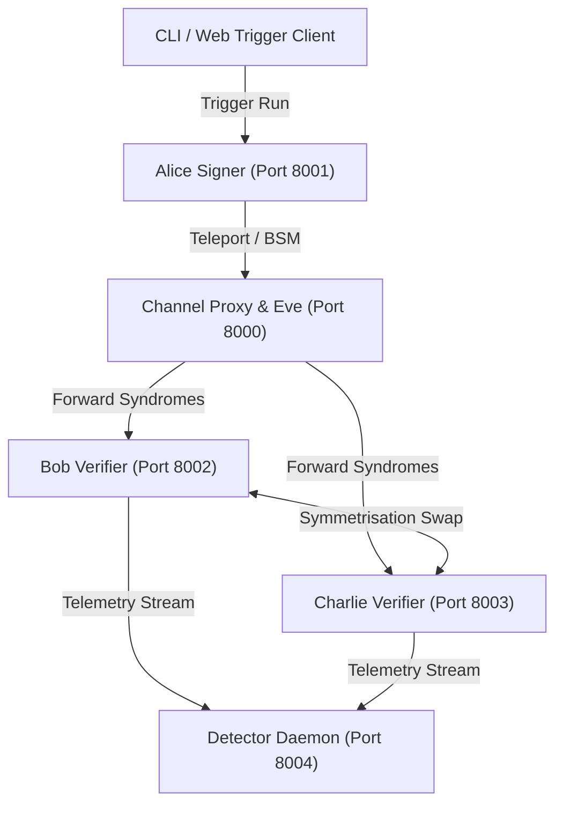

# 🚀 Quantum Communication & Teleportation-Based QDS Simulator (Stages 1–5)

Welcome to the **Quantum Communication Simulator & Quantum Digital Signature (QDS) Framework**! This repository provides a modular, Qiskit 2.x-based simulation and cyber threat detection engine for quantum key distribution (BB84), quantum state preparation, quantum teleportation with feed-forward Pauli corrections, multi-vector threat simulation, non-AI deterministic threat detection, and distributed socket network daemons.

---

## 📌 Executive Summary

Modern public-key cryptosystems (RSA, ECDSA) rely on computational hardness assumptions vulnerable to quantum algorithms like **Shor's Algorithm**. 

This framework implements **Information-Theoretic Security (ITS)** through:
* **Quantum Physics Fundamentals**: Heisenberg Uncertainty Principle, Quantum No-Cloning Theorem, and Quantum Entanglement ($|\Phi^+\rangle$).
* **Teleportation-Based QDS**: Transmission of signature tokens via Bell-State Measurements (BSM) and Pauli feed-forward gates ($X^{m_2} Z^{m_1}$).
* **Symmetrisation & Elimination**: Symmetrisation swap protocols (Keep/Forward) preventing repudiation and orthogonal state elimination against forgery.
* **Deterministic Threat Detection (No AI/ML)**: Physics-grounded anomaly classification using Chernoff-Hoeffding statistical hypothesis testing and parity divergence.
* **Distributed Network Grid**: Multi-daemon asynchronous TCP architecture with proxy routing, live verifiers, and threat monitoring.

---

## 📁 Repository Directory Structure

```text
sih 2026/
├── pyproject.toml                     # Package & dependency metadata
├── requirements.txt                   # Production dependencies
├── README.md                          # Comprehensive technical reference
├── README_FOR_DUMMIES.md              # Beginner-friendly guide with analogies
├── OVERVIEW.md                        # Architectural whitepaper & protocol specification
├── launch_network.py                  # Python launcher for distributed socket daemon grid
├── launch_cluster.bat                 # Windows Batch orchestrator for all 5 daemons
├── src/
│   └── quantum_sim/
│       ├── __init__.py                # Package root
│       ├── core/                      # Low-level Qiskit circuit building & teleportation
│       │   ├── __init__.py
│       │   └── circuit.py             # BB84 state prep, Bell pairs, & BSM teleportation
│       ├── channel/                   # Channel models, noise & attacks
│       │   ├── __init__.py
│       │   ├── base.py                # QuantumChannel container
│       │   ├── noise.py               # BitFlip, PhaseFlip, & Depolarizing noise
│       │   └── attacks.py             # InterceptResendAttack class
│       ├── nodes/                     # Network participant abstractions
│       │   ├── __init__.py
│       │   └── node.py                # Node class (Alice, Bob, Charlie)
│       ├── protocols/                 # Protocol execution workflows
│       │   ├── __init__.py
│       │   ├── base.py                # BaseProtocol abstract interface
│       │   ├── point_to_point.py      # Stage 1: Point-to-Point BB84 protocol
│       │   ├── secure_point_to_point.py # Stage 2: BB84 with Cascade & Privacy Amplification
│       │   ├── qds.py                 # Stage 3: Prepare-and-Measure WDKA QDS
│       │   └── teleportation_qds.py   # Stage 5: Teleportation-based QDS with Chernoff bounds
│       ├── attacks/                   # Threat simulation engine
│       │   ├── __init__.py
│       │   └── qds_threats.py         # Multi-vector threats (Forgery, Repudiation, Tampering, Replay)
│       ├── detection/                 # Threat analysis & diagnostics
│       │   ├── __init__.py
│       │   └── engine.py              # Non-AI deterministic QDSDetectionEngine & certificates
│       ├── network/                   # Multi-port distributed TCP socket grid
│       │   ├── __init__.py
│       │   ├── socket_node.py         # Base asynchronous TCP socket client/server
│       │   ├── messages.py            # Typed JSON messaging schema & serialization
│       │   ├── channel_proxy.py       # Port 8000: Quantum Channel Router & Attack Proxy
│       │   ├── alice_daemon.py        # Port 8001: Signer Node Daemon
│       │   ├── verifier_daemon.py     # Port 8002/8003: Verifier Daemons (Bob & Charlie)
│       │   ├── detector_daemon.py     # Port 8004: Central Threat Detection Monitor Daemon
│       │   └── run_node.py            # CLI node launcher utility
│       └── utils/                     # Cryptographic & statistical utilities
│           ├── __init__.py
│           ├── metrics.py             # Bit extraction, basis sifting, & QBER estimation
│           ├── post_processing.py     # Cascade error reconciliation & Universal Hashing
│           ├── freshness.py           # Nonce & timestamp anti-replay validation
│           └── security_analysis.py   # Chernoff-Hoeffding bounds & security parameters
├── tests/                             # Pytest automated test suite (33 unit tests)
│   ├── test_circuit.py                # Quantum gates, Bell pairs & Teleportation tests
│   ├── test_channel.py                # Noise models & intercept-resend channel tests
│   ├── test_metrics.py                # Sifting & QBER calculation validation
│   ├── test_protocol.py               # BB84 point-to-point protocol tests
│   ├── test_stage2.py                 # Cascade error correction & privacy amplification tests
│   ├── test_qds.py                    # Stage 3 WDKA QDS protocol tests
│   ├── test_stage4_threats.py         # Threat engine & deterministic detection engine tests
│   ├── test_teleportation_qds.py      # Teleportation QDS & Pauli feed-forward tests
│   ├── test_security_bounds.py        # Chernoff-Hoeffding math & certificate validation
│   └── test_socket_network.py         # Distributed multi-daemon TCP socket communication tests
├── examples/                          # Runnable CLI demonstration scripts
│   ├── stage1_demo.py                 # Stage 1: Basic BB84 loop & Intercept detection
│   ├── stage2_demo.py                 # Stage 2: Noise, Cascade correction & Privacy hashing
│   ├── stage3_demo.py                 # Stage 3: Prepare-and-Measure QDS signature loop
│   ├── stage4_demo.py                 # Stage 4: Multi-vector threat simulator & detection engine
│   ├── stage5_teleportation_demo.py   # Stage 5: Teleportation QDS & live Chernoff bounds
│   └── trigger_client.py              # CLI client to dispatch test runs to live socket daemons
└── visualizer/                        # Interactive web telemetry dashboard
    ├── index.html                     # Visualizer interface & control panels
    ├── styles.css                     # Premium dark-theme cyber UI styling
    └── app.js                         # Teleportation simulator, Attack lab & Chernoff plotter
```

---

## 🏛️ Stage-by-Stage Architecture Breakdown

| Stage | Module Name | Primary Features | Core Scientific / Cryptographic Mechanism |
| :--- | :--- | :--- | :--- |
| **Stage 1** | **Core Quantum Loop** | Circuit synthesis, basic channel, basis sifting, QBER calculation. | $Z / X$ basis measurements, BB84 state preparation, Intercept-Resend detection. |
| **Stage 2** | **Noisy Channels & Key Agreement** | Fiber noise models, error correction, privacy amplification. | Bit/Phase flip, Depolarizing noise, Cascade parity bisection, Universal Hashing. |
| **Stage 3** | **Prepare-and-Measure QDS** | 3-party QDS protocol, Keep/Forward symmetrisation, state elimination. | Non-orthogonal state generation ($\{\|0\rangle, \|1\rangle, \|+\rangle, \|-\rangle\}$), orthogonal elimination, contradiction counting. |
| **Stage 4** | **Threat Simulation & Deterministic Detection** | Multi-vector threat generator, non-AI detection engine, security certificates. | Repudiation, Dishonest Verifier framing, Forgery, Replay, asymmetry divergence ($|e_B - e_C|$). |
| **Stage 5** | **Teleportation QDS & Information Bounds** | Entangled Bell pairs, BSM, feed-forward Pauli corrections, Chernoff bounds. | $|\Phi^+\rangle = \frac{\|00\rangle + \|11\rangle}{\sqrt{2}}$, $X^{m_2} Z^{m_1}$, Chernoff-Hoeffding bound $P_{\text{forge}} \le e^{-2\delta^2 L}$, security parameter $\epsilon$. |

---

## 🔬 File-by-File & Class Breakdown

### 1. `src/quantum_sim/core/circuit.py`
Low-level quantum circuit generation with Qiskit:
* **`prepare_bb84_state(bits, bases)`**: Encodes classical bits into single-qubit states using Pauli-$X$ and Hadamard ($H$) gates.
* **`add_bb84_measurement(qc, bases)`**: Appends basis transformation ($H$ for $X$-basis) and projective measurement gates (`measure`).
* **`create_bell_pair(qc, q1, q2)`**: Creates maximally entangled Bell pairs $|\Phi^+\rangle = \frac{|00\rangle + |11\rangle}{\sqrt{2}}$ via `H(q1)` and `CX(q1, q2)`.
* **`build_teleportation_circuit(payload_bit, payload_basis, apply_corrections=True)`**: Generates a 3-qubit teleportation circuit implementing Bell-State Measurement (BSM: `CX` + `H` + classical measurement) and conditional Pauli corrections ($X^{m_2} Z^{m_1}$).
* **`simulate_teleportation(...)`**: Executes the circuit on Qiskit's `AerSimulator` and validates state fidelity.

### 2. `src/quantum_sim/channel/`
Simulates optical fiber propagation, physical noise, and channel adversaries:
* **`base.py -> QuantumChannel`**: Applies noise models and active attacks sequentially to in-flight quantum circuits.
* **`noise.py -> BitFlipNoise, PhaseFlipNoise, DepolarizingNoise`**: Simulates environmental quantum decoherence and fiber attenuation.
* **`attacks.py -> InterceptResendAttack`**: Eavesdropper (Eve) intercepts qubits, measures in a random basis, and resends prepared eigenstates.

### 3. `src/quantum_sim/nodes/node.py`
* **`Node(name)`**: Represents autonomous network actors (`Alice`, `Bob`, `Charlie`). Maintains local keys, token stores, and eliminated state dictionaries.

### 4. `src/quantum_sim/protocols/`
* **`point_to_point.py -> PointToPointProtocol`**: Basic point-to-point BB84 QKD protocol execution.
* **`secure_point_to_point.py -> SecurePointToPointProtocol`**: Integrates Cascade parity-check error reconciliation and Toeplitz/Universal hashing privacy amplification.
* **`qds.py -> QDSProtocol`**: Direct prepare-and-measure 3-party QDS protocol with Keep/Forward symmetrisation swap.
* **`teleportation_qds.py -> TeleportationQDSProtocol`**: Teleportation-based QDS distributing signature tokens across entangled channels, executing state elimination, asymmetry checking, and Chernoff-Hoeffding security bound validation.

### 5. `src/quantum_sim/attacks/qds_threats.py`
Multi-vector threat simulation framework:
* **`ForgedSignatureAttack`**: External adversary constructs forged signature tokens to spoof Alice.
* **`DishonestVerifierAttack`**: Dishonest Bob alters forwarded tokens to Charlie to frame Alice or induce false verification.
* **`RepudiationAttack`**: Alice sends conflicting signature states to Bob and Charlie, attempting to deny signing later.
* **`ChannelTamperingAttack`**: Active in-transit perturbation of quantum and classical syndrome channels.
* **`ReplayAttack`**: Captures and replays expired signature broadcasts.

### 6. `src/quantum_sim/detection/engine.py`
* **`QDSDetectionEngine`**: Pure deterministic (non-AI/ML) cryptanalysis engine. Evaluates:
  * **Bit Error Mismatch Rate ($e_B, e_C$)** against Chernoff acceptance thresholds ($s_a, s_v$).
  * **Asymmetry Divergence** $\Delta_e = |e_B - e_C|$ to distinguish repudiation from channel noise.
  * **Freshness & Nonce Registry** to identify replay attempts.
  * **Certificate Generation**: Issues structured JSON security reports with information-theoretic confidence metrics.

### 7. `src/quantum_sim/utils/`
* **`metrics.py`**: Bit extraction from Qiskit counts, basis sifting, and QBER estimation.
* **`post_processing.py`**: Cascade iterative error correction and universal hash privacy amplification.
* **`freshness.py -> FreshnessTracker`**: Sliding-window timestamp and cryptographic nonce tracker.
* **`security_analysis.py -> QDSSecurityBounds`**: Computes Chernoff-Hoeffding bounds:
  $$P_{\text{forge}} \le \exp\left(-2 \delta^2 L\right)$$
  Computes optimal acceptance threshold $s_a$ and verification threshold $s_v$, and derives security parameter $\epsilon = \log_2(1 / P_{\text{bound}})$.

### 8. `src/quantum_sim/network/`
Distributed multi-port asynchronous TCP daemon architecture:
* **`socket_node.py`**: Base asynchronous TCP network node with line-delimited JSON RPC streaming.
* **`messages.py`**: Message types (`SETUP_SESSION`, `TELEPORT_TOKEN`, `BSM_SYNDROME`, `SYMMETRISE_SWAP`, `SIGN_BROADCAST`, `VERIFY_RESULT`, `TELEMETRY_EVENT`).
* **`channel_proxy.py` (Port 8000)**: Simulates physical fiber router and adversary injection proxy.
* **`alice_daemon.py` (Port 8001)**: Signer node daemon generating tokens, Bell pairs, and signature broadcasts.
* **`verifier_daemon.py` (Ports 8002 & 8003)**: Verifier daemons (Bob & Charlie) performing Pauli corrections, symmetrisation, elimination, and signature checking.
* **`detector_daemon.py` (Port 8004)**: Real-time telemetry ingestion and security audit daemon.

---

## 🌐 Distributed Socket Daemon Architecture



---

## 🚀 Quick Start Guide

### 1. Installation
Install all requirements in your Python virtual environment (Python 3.10+ recommended):
```powershell
pip install -r requirements.txt
```

### 2. Run All Automated Unit Tests
Verify all 33 unit tests pass across core circuits, protocols, threats, security bounds, and socket daemons:
```powershell
pytest
```

### 3. Run Standalone CLI Demos
Execute individual stage demonstrations:

* **Stage 1 — Basic BB84 Loop & Intercept Attack**:
  ```powershell
  python examples/stage1_demo.py
  ```

* **Stage 2 — Channel Noise, Error Correction & Privacy Hashing**:
  ```powershell
  python examples/stage2_demo.py
  ```

* **Stage 3 — Prepare-and-Measure QDS**:
  ```powershell
  python examples/stage3_demo.py
  ```

* **Stage 4 — Multi-Vector Threat Simulator & Deterministic Engine**:
  ```powershell
  python examples/stage4_demo.py
  ```

* **Stage 5 — Teleportation-Based QDS & Chernoff Bounds**:
  ```powershell
  python examples/stage5_teleportation_demo.py
  ```

### 4. Launch Distributed Socket Cluster & Dispatch Run
Start all 5 distributed daemons simultaneously and trigger an end-to-end QDS signing session:

```powershell
# Method A: Using the Python orchestrator
python launch_network.py

# Method B: Using Windows Batch Script (opens 5 separate daemon terminal windows)
.\launch_cluster.bat

# In another terminal, trigger a signing run:
python examples/trigger_client.py --message 1 --length 128
```

### 5. Launch Interactive Telemetry & Threat Visualizer
Open [visualizer/index.html](file:///e:/2026-2/sih%202026/visualizer/index.html) in any modern web browser to access:
* **Interactive 5-Step Teleportation Protocol Inspector** with live state vectors.
* **Cyber Threat & Attack Lab** (inject eavesdropping, repudiation, verifier framing, or replays).
* **Deterministic Threat Detection Dashboard** with real-time verdicts and confidence meters.
* **Live Chernoff-Hoeffding Security Bound Plotter** ($P_{\text{bound}}$ vs. signature length $L$).
* **Pauli Correction Truth Table & 3-Qubit Circuit Visualizer**.

---

## 📊 Theoretical Security Guarantees

The protocol guarantees **Information-Theoretic Security** against all classical and quantum adversaries:
1. **Unforgeability**: An adversary without access to Alice's private token basis cannot forge a signature without inducing an error rate $e > s_v$.
2. **Non-Repudiation**: Alice cannot generate token states that pass Bob's verification ($e_B \le s_a$) while failing Charlie's verification ($e_C > s_v$) due to Keep/Forward symmetrisation swap.
3. **Robustness**: Legitimate transmissions in channels with noise rate $p_{\text{noise}} < s_a$ are accepted with probability $1 - P_{\text{abort}}$.

---

## 📜 License
Developed for the Smart India Hackathon (SIH 2026). Modular, extensible, and open for educational and research exploration in Quantum Cryptography & Cyber Security.
