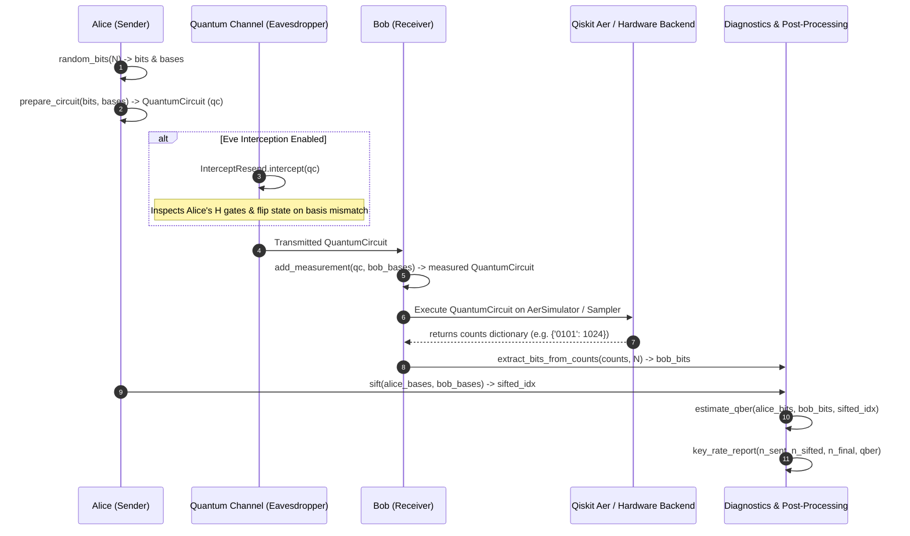

# Qiskit QKD Lab: Deep-Dive Technical Breakdown & Architecture Roadmap

This document provides a comprehensive technical analysis of the **`qiskit-qkd-lab`** codebase (v0.2.0), evaluating its architecture, data flow, Qiskit integration, reusability, and mapping against your 4-stage Quantum Communication & Digital Signature project.

---

## 1. Project Structure

The `qiskit-qkd-lab` library is a lightweight, focused Python package built on top of Qiskit (>=2.0) and Qiskit Aer (>=0.15). The entire codebase consists of **7 primary Python files** organized into three modules:

```text
qiskit_qkd_lab/
├── __init__.py               # Top-level exports
├── protocols/                # Quantum state preparation & measurement protocols
│   ├── __init__.py           # Protocol exports
│   └── bb84.py               # BB84 state prep, measurement, sifting logic
├── channel/                  # Channel operations & threat models
│   ├── __init__.py           # Channel exports
│   └── eavesdrop.py          # Adversary interception classes & circuit modifications
└── diagnostics/              # Metric calculations & statistical reporting
    ├── __init__.py           # Diagnostics exports
    └── qber.py               # QBER estimation & efficiency reporting
```

### Key Modules, Files, Classes, and Functions

| Module / File | Symbol / Component | Type | Responsibility & Implementation Details |
| :--- | :--- | :--- | :--- |
| **`protocols/bb84.py`** | `random_bits(n, rng)` | Function | Generates a 1D NumPy array of $n$ uniform random bits ($\in \{0,1\}$). |
| | `prepare_circuit(bits, bases)` | Function | Constructs a `QuantumCircuit` with $n$ qubits. Applies `X` gate if bit=1, and `H` gate if basis=1 (X-basis encoding). |
| | `add_measurement(qc, bob_bases)` | Function | Copies the circuit and appends Bob's measurements. Applies `H` gate prior to measurement if basis=1. |
| | `extract_bits_from_counts(counts, n_qubits)` | Function | Parses Qiskit backend bitstring outputs (e.g., `{"0101": 1024}`) to extract the most probable outcome as a NumPy bit array. |
| | `sift(alice_bases, bob_bases)` | Function | Identifies matching index positions where `alice_bases == bob_bases`. |
| **`channel/eavesdrop.py`** | `Eavesdropper` | ABC | Abstract Base Class defining the contract (`intercept(circuit, rng)`) for adversarial channel modifications. |
| | `InterceptResend(p_intercept)` | Class | Concrete implementation of an Intercept-and-Resend attack with probability $p$. |
| | `_alice_basis_for_qubit(circuit, index)` | Static Method | Helper that inspects `circuit.data` to check if Alice used an `H` gate on a qubit index. |
| **`diagnostics/qber.py`** | `estimate_qber(...)` | Function | Subsamples a fraction (default 50%) of sifted bits to calculate Quantum Bit Error Rate ($QBER = \frac{\text{mismatches}}{\text{sampled}}$). |
| | `key_rate_report(...)` | Function | Computes sifting efficiency ($\frac{n_{sifted}}{n_{sent}}$), overall efficiency, and flags `eve_likely` if $QBER > 0.25$. |

---

## 2. Architecture & Data Flow

The operational pipeline follows a sequential workflow from Alice to Bob, mediated by the channel and backend execution.



### Step-by-Step Data Flow Breakdown

1. **State Generation**: Alice generates secret bit array $A$ and basis array $B_A$ using `random_bits()`.
2. **Circuit Synthesis**: `prepare_circuit()` instantiates a `QuantumCircuit(n, n)`. Single-qubit states are mapped as:
   - Basis 0 (Z-basis): $|0\rangle \xrightarrow{I} |0\rangle$, $|1\rangle \xrightarrow{X} |1\rangle$
   - Basis 1 (X-basis): $|0\rangle \xrightarrow{H} |+\rangle$, $|1\rangle \xrightarrow{X, H} |-\rangle$
3. **Channel Transmission / Eavesdropping**:
   - `InterceptResend.intercept()` duplicates the circuit.
   - For each qubit, with probability `p_intercept`, Eve measures in a randomly chosen basis.
   - If Eve's basis matches Alice's basis, no error is introduced.
   - If Eve's basis differs, there is a 50% chance of disturbing the state, simulated by appending an `X` gate (`disturbed.x(index)`).
4. **Bob Measurement**:
   - Bob selects random bases $B_B$.
   - `add_measurement()` appends `H` gates on qubits where $B_B[i] == 1$, followed by `measure(q[i], c[i])`.
5. **Simulation / Execution**:
   - The compiled circuit is submitted to a Qiskit backend (`AerSimulator` or IBM Quantum Hardware).
6. **Sifting & Diagnostics**:
   - `sift()` filters indices where $B_A[i] == B_B[i]$.
   - `estimate_qber()` samples a subset of the sifted indices to compare Alice's and Bob's bits, calculating the error rate ($QBER$).
   - `key_rate_report()` summarizes bit counts and flags potential eavesdropping ($QBER > 25\%$).

---

## 3. Qiskit vs. QKD Lab Responsibilities

It is vital to distinguish between what Qiskit provides natively and what QKD Lab implements on top of it.

```text
+-----------------------------------------------------------------------+
|                         qiskit-qkd-lab                                |
|  +---------------------+  +---------------------+  +-----------------+  |
|  | BB84 Protocol Logic |  | Eavesdropping Model |  | QBER & Metrics  |  |
|  | (prepare/sift/read) |  | (InterceptResend)   |  | Diagnostics     |  |
|  +---------------------+  +---------------------+  +-----------------+  |
+-----------------------------------||----------------------------------+
                                    || Uses
+-----------------------------------\/----------------------------------+
|                            Qiskit SDK                                 |
|  +--------------------+  +---------------------+  +-----------------+ |
|  | QuantumCircuit     |  | Gate Operations     |  | Classical &     | |
|  | Data Structure     |  | (X, H, Measure)     |  | Quantum Regs    | |
|  +--------------------+  +---------------------+  +-----------------+ |
+-----------------------------------||----------------------------------+
                                    || Executes on
+-----------------------------------\/----------------------------------+
|                   Qiskit Aer / Hardware Backend                       |
|  +-----------------------------------------------------------------+  |
|  | AerSimulator / Primitives (Sampler, Estimator)                  |  |
|  +-----------------------------------------------------------------+  |
+-----------------------------------------------------------------------+
```

### Detailed Feature Breakdown

| Feature / Capability | Provided by Qiskit Core / Aer | Provided by `qiskit-qkd-lab` | Explanation |
| :--- | :---: | :---: | :--- |
| **Quantum Gate Execution** | **Yes** | No | `X`, `H`, `measure` are native Qiskit circuit operations. |
| **State Vector & Noise Simulation**| **Yes** | No | Qiskit Aer handles state manipulation, matrix multiplication, and shot simulation. |
| **Basis Transformation Logic** | No | **Yes** | `qiskit-qkd-lab` decides when to apply `H` gates for Z/X basis encoding/decoding. |
| **Circuit Eavesdropping** | No | **Yes** | `qiskit-qkd-lab` modifies the `QuantumCircuit` to simulate Eve's interception. |
| **Basis Sifting** | No | **Yes** | Classical matching of basis arrays ($B_A == B_B$) is custom Python logic in `bb84.py`. |
| **Bitstring Decoding** | Partial | **Yes** | Qiskit outputs raw bitstring counts (`{"01": 1024}`); `extract_bits_from_counts` parses it into NumPy arrays. |
| **QBER & Security Thresholds** | No | **Yes** | Error rate sampling and $25\%$ threshold detection are implemented in `qber.py`. |

---

## 4. QKD-Specific vs. Generic Code Components

To build a modular simulator capable of handling future protocols (such as **QDS**), we must isolate QKD-specific assumptions from generic quantum communication building blocks.

### A. QKD-Specific Components (BB84 Specific)
1. **Basis-Matching Sifting (`bb84.sift`)**: Compares Alice's and Bob's 2-basis choices ($Z$ and $X$). QDS protocols do not rely on classical basis sifting in this manner.
2. **2-Basis State Encoding (`bb84.prepare_circuit`)**: Tailored specifically for encoding single bits into single-qubit Z/X bases.
3. **Hardcoded QBER Threshold (`qber.key_rate_report`)**: Uses a fixed $25\%$ threshold (`qber > 0.25`), which is specific to BB84 under intercept-resend attacks.
4. **Hadamard-Inspection Eavesdropper (`_alice_basis_for_qubit`)**: Eve inspects the circuit structure specifically looking for `H` gates. This is a BB84-specific simulation shortcut, not a realistic physical channel eavesdropper.

### B. Generic Quantum Communication Components (Reusable)
1. **Abstract Channel Eavesdropper Interface (`Eavesdropper`)**: ABC pattern for intercepting and altering quantum circuits in transit.
2. **Measurement Counts Converter (`extract_bits_from_counts`)**: Generic utility that maps Qiskit dictionary counts to integer NumPy arrays.
3. **Subsampled Error Estimator (`estimate_qber`)**: Statistical sampling logic to measure bit disagreement between two bit arrays.
4. **Circuit Execution Wrapper**: The underlying design pattern of creating a `QuantumCircuit`, modifying it via a channel, applying measurement gates, and running it on a simulator backend.

---

## 5. Code Reusability & License Analysis

### License & Attribution Requirements
- **License**: **MIT License** (Copyright (c) 2026 Rex Rowan).
- **Permissions**: You are free to copy, modify, merge, publish, distribute, sub-license, and use the code commercially or academically.
- **Requirements**: You **must include the original copyright notice and MIT license text** in any substantial copies or derived portions of the software.

### Code Categorization for Our Project

```text
               +-------------------------------------------------+
               |              qiskit-qkd-lab Code                |
               +-------------------------------------------------+
                                        |
      +--------------------+------------+------------+--------------------+
      |                    |                         |                    |
      v                    v                         v                    v
[Reuse Directly]  [Reuse w/ Modifications]    [Should Rewrite]     [Should Not Use]
 - bit parsing     - Eavesdropper ABC          - InterceptResend    - Fixed 25% Eve
 - estimate_qber   - prepare_circuit           - Protocol runner      threshold
                   - add_measurement           - Basis sifting      - Gate-inspection
                                                                      hacks
```

1. **Can Reuse Directly**:
   - `extract_bits_from_counts()`: Perfectly reusable for converting single-shot or multi-shot measurement results into bit arrays.
   - `estimate_qber()`: Generic statistical sampling algorithm suitable for testing error rates in any dual-party transmission.
2. **Can Reuse with Modifications**:
   - `Eavesdropper` Abstract Class: Good interface design; modify to pass general quantum channel parameter objects (noise models, loss probability).
   - `prepare_circuit()` / `add_measurement()`: Generalize beyond 1D single-qubit BB84 vectors to support arbitrary state vectors, multi-qubit states, or multi-party destination routing.
3. **Should Rewrite**:
   - `InterceptResend`: Rewrite using Qiskit Aer noise models or physical quantum measurement operations (e.g. measuring in a random basis using actual quantum gates and collapsed states) rather than parsing `circuit.data` for `H` gates.
   - Protocol Execution Flow: Replace procedural function calls with a clean Object-Oriented design (`Node`, `Channel`, `Protocol`).
4. **Should Not Use**:
   - `key_rate_report()` hardcoded `qber > 0.25` logic: Replace with configurable security threshold classes and dynamic statistical hypothesis tests.

---

## 6. Comparison with Project Requirements

| Project Stage | Already Available in `qiskit-qkd-lab` | Missing in `qiskit-qkd-lab` | What We Need to Build |
| :--- | :--- | :--- | :--- |
| **Stage 1: Quantum Communication** | • Basic circuit prep (`prepare_circuit`)<br>• Basis measurement (`add_measurement`)<br>• Execution wrapper on `AerSimulator` | • Realistic optical channel models (attenuation, phase noise, depolarizing noise)<br>• Multi-qubit / Entangled state support<br>• Multi-party network topologies (Alice-Bob-Charlie) | • Modular Quantum Channel engine<br>• Node abstractions (`Alice`, `Bob`, `Charlie`)<br>• Multi-party quantum state distribution |
| **Stage 2: Secure Communication** | • Basis sifting (`sift`)<br>• Basic QBER estimation (`estimate_qber`) | • Error Reconciliation / Cascade protocol / LDPC<br>• Privacy Amplification (Toeplitz hashing)<br>• Classical authentication channel | • Classical Post-Processing Pipeline<br>• Shared Secret Key Generator & Encryptor (AES / OTP) |
| **Stage 3: QDS Protocol** | **None** *(QKD $\neq$ QDS)* | • Everything (Quantum State Distribution to multiple receivers, Vector Hash Swap/Verification, Non-repudiation logic) | • Complete QDS Protocol Engine (e.g. Gottesman-Chuang or Arrazola-Lütkenhaus QDS) |
| **Stage 4: Threat Simulation & Detection** | • 1 basic attack (`InterceptResend`) | • Advanced attacks (Photon Number Splitting, Phase Flips, Denial of Service, Trojan Horse)<br>• Intrusion Detection System (IDS)<br>• Real-time Anomaly Detection | • Threat Simulator Suite<br>• Statistical Anomaly Detector & Security Dashboard |

> [!IMPORTANT]
> **Key Conceptual Distinction**: **QKD (Quantum Key Distribution)** establishes a *shared symmetric secret key* between two parties (Alice and Bob). **QDS (Quantum Digital Signature)** provides *asymmetric-like digital signatures* (Authentication, Integrity, Non-repudiation) across three or more parties (Alice, Bob, Charlie). BB84 cannot be used directly as a QDS protocol; QDS requires multi-party distribution of quantum states and verification protocols to prevent forgery and repudiation.

---

## 7. Recommended System Architecture

To ensure your simulator easily scales from Stage 1 (Basic Quantum Comm) to Stage 4 (Threat Detection & QDS), we propose a **6-Layer Decoupled Architecture**.

```text
+-----------------------------------------------------------------------+
|  Layer 6: Threat & Analytics (IDS, Anomaly Detection, Dashboard)      |
+-----------------------------------------------------------------------+
                                   |
+-----------------------------------------------------------------------+
|  Layer 5: Classical Security (Reconciliation, Privacy Amplification)  |
+-----------------------------------------------------------------------+
                                   |
+-----------------------------------------------------------------------+
|  Layer 4: Protocol Layer (BB84 Engine, E91 Engine, QDS Engine)       |
+-----------------------------------------------------------------------+
                                   |
+-----------------------------------------------------------------------+
|  Layer 3: Actor & Node Layer (Alice, Bob, Charlie Node Classes)       |
+-----------------------------------------------------------------------+
                                   |
+-----------------------------------------------------------------------+
|  Layer 2: Channel & Environment Layer (Attenuation, Noise, Attacks)   |
+-----------------------------------------------------------------------+
                                   |
+-----------------------------------------------------------------------+
|  Layer 1: Core Quantum Engine (Qiskit Primitives & Circuit Builders)  |
+-----------------------------------------------------------------------+
```

### Layer Specification

1. **Layer 1: Core Quantum Engine (`simulator.core`)**
   - Wraps Qiskit `QuantumCircuit` creation, basis transformation gates, backend configuration (`AerSimulator`), and bit extraction.
2. **Layer 2: Channel & Environment Layer (`simulator.channel`)**
   - Simulates physical optical fiber/free-space loss, depolarizing noise, phase damping, and hosts attack interfaces (`InterceptResendAttack`, `PNSAttack`).
3. **Layer 3: Actor & Node Layer (`simulator.nodes`)**
   - Defines `Node` base class and concrete implementations (`AliceNode`, `BobNode`, `CharlieNode`). Nodes maintain state, generate random bases, and process incoming quantum/classical registers.
4. **Layer 4: Protocol Layer (`simulator.protocols`)**
   - Abstract `BaseProtocol`. Implements protocol implementations: `BB84Protocol` (Stage 1/2) and `QDSProtocol` (Stage 3).
5. **Layer 5: Classical Post-Processing Layer (`simulator.security`)**
   - Classical error correction (Cascade / LDPC), privacy amplification (Toeplitz matrices), and symmetric encryption (OTP / AES-GCM).
6. **Layer 6: Threat & Analytics Layer (`simulator.threats`)**
   - Aggregates metrics (QBER, sifting rate, bit error distribution) and runs statistical test suites (Chi-Square, Sequential Probability Ratio Test) to detect active eavesdroppers.

---

## 8. Stage 1 Practical Development Plan

### Scope for Stage 1
- **Goal**: Build a robust, modular Quantum Communication Simulator Engine supporting quantum state preparation, channel transmission with noise/attack hooks, measurement, and bit recovery.
- **Keep from QKD Lab**: `extract_bits_from_counts` utility, basic `estimate_qber` logic.
- **Modify**: Standardize state preparation into generic circuit builders.
- **Build Ourselves**: Object-oriented `QuantumChannel`, `Node` framework, and extensible `BaseAttack` class.
- **Do NOT Implement Yet**: Classical error reconciliation, privacy amplification, QDS protocol, advanced web UI.

### First 10 Coding Steps for Stage 1

1. **Step 1: Set Up Directory & Environment**
   Create package layout under `src/quantum_sim/`: `core/`, `channel/`, `nodes/`, `protocols/`, `utils/`.
2. **Step 2: Implement Core Quantum Utilities (`core/circuit.py`)**
   Write single-qubit and multi-qubit state preparation functions wrapping Qiskit `QuantumCircuit`.
3. **Step 3: Implement Bit Parsing & Diagnostics (`utils/metrics.py`)**
   Port and refine `extract_bits_from_counts` and `estimate_qber` with proper typing and error handling.
4. **Step 4: Create Abstract Channel Class (`channel/base.py`)**
   Define `QuantumChannel` class that accepts a `QuantumCircuit`, applies channel loss/noise models, and returns the modified circuit.
5. **Step 5: Add Channel Attack Interface (`channel/attacks.py`)**
   Create `BaseAttack` class and implement a clean `InterceptResendAttack` that applies actual quantum measurements/gates rather than inspecting circuit metadata.
6. **Step 6: Build Node Abstractions (`nodes/node.py`)**
   Implement `Node` class with methods for `prepare_state()`, `apply_measurement()`, and memory storage for classical bits and bases.
7. **Step 7: Create Base Protocol Interface (`protocols/base.py`)**
   Define `BaseProtocol` with abstract steps: `setup()`, `transmit()`, `measure()`, `process()`.
8. **Step 8: Implement Stage 1 Point-to-Point Protocol (`protocols/point_to_point.py`)**
   Implement a clean point-to-point quantum transmission pipeline between `Alice` and `Bob`.
9. **Step 9: Build Unit Test Suite (`tests/`)**
   Write `pytest` tests validating zero-error transmission under ideal channels and ~25% QBER under full intercept-resend attacks.
10. **Step 10: Create Stage 1 CLI / Demo Script (`examples/stage1_demo.py`)**
    Demonstrate Alice transmitting quantum states to Bob through an eavesdropped channel with full measurement output logging.

---

## What I Should Do Next

To immediately kick off your project based on this roadmap, here are your next action steps:

1. **Initialize Project Directory**: Create a clean repository structure (e.g. `mkdir -p src/quantum_sim/{core,channel,nodes,protocols,utils} tests examples`).
2. **Copy Core Utilities**: Adapt `extract_bits_from_counts` and `estimate_qber` from `qiskit-qkd-lab` into `src/quantum_sim/utils/metrics.py` (including the MIT license attribution).
3. **Build Layer 1 (`core/circuit.py`)**: Implement clean Qiskit state prep and measurement primitives.
4. **Run Verification Script**: Create a basic script to verify state transmission on `AerSimulator`.
